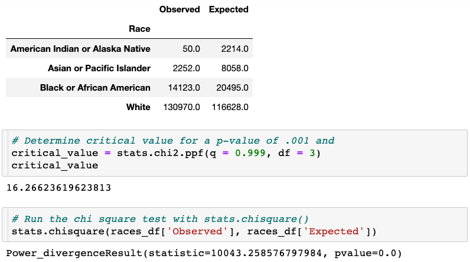
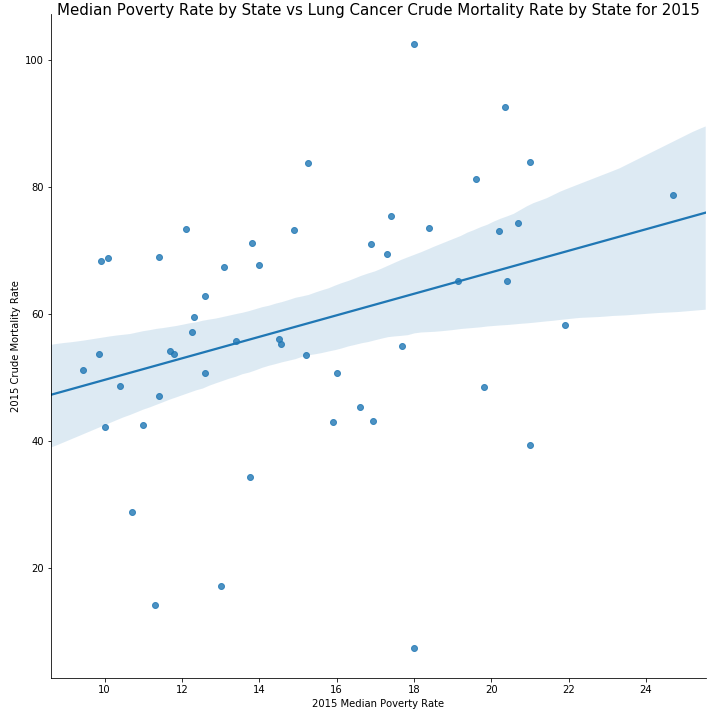
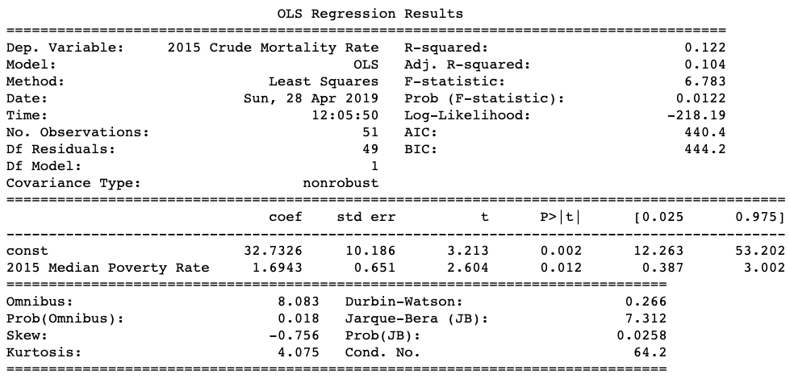
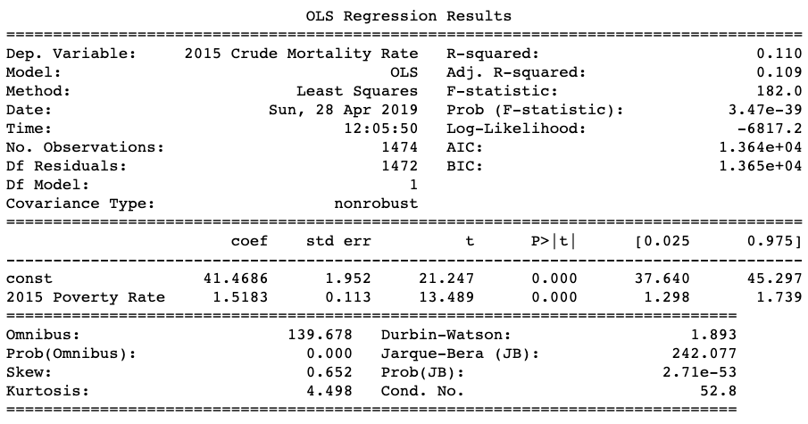

# Lung Cancer: Death & Demographics

## Team Members
* Abear Awadallah
* Mike Ingram
* Gretel Uptegrove
* Brown Varghese

## Motivation

* Lung cancer is one of the six leading causes of death in the World (according to WHO-World Health Organization), and it is important to understand the relationship between demographics and lung cancer death in order to adequately address prevention and treatment.
* Questions: What demographics are correlated with lung cancer mortality?

## Sources
* [CDC Wonder](https://wonder.cdc.gov/)
    * Lung Cancer Deaths broken down by:
        * Location (State & County Level)
        * Race
        * Age Range (by 5 year increments)
        * Gender
* [FRED Economics Data](https://fred.stlouisfed.org/)
    * Poverty Rate broken down by Location (State & County Level)

## Methods
* Query [CDC Wonder](https://wonder.cdc.gov/) and [FRED Economics Data](https://fred.stlouisfed.org/) databases
* Clean data within a [Jupyter notebook: Data_Cleaning.ipynb](Data_Cleaning.ipynb) using Python and pandas library.
* Create visualizations and perform statistical analysis within a [Jupyter notebook: data_analysis.ipynb](data_analysis.ipynb) using the following Python libraries
  * pandas
  * NumPy
  * Matplotlib
  * SciPy
  * seaborn

## Major Findings

### Race & Lung Cancer Mortality

* Hypothesis testing:
    * Null Hypothesis(H0): There is no relationship between race and lung cancer mortality in 2015.
    * Alternative Hypothesis(H1): There is a relationship between race and lung cancer mortality in 2015.
* Statistical Testing: Chi-Squared Goodness of Fit Test

* Results of Test: The Chi-Squared value (10042.59) exceeded the critical value (16.27) with a p-value of .001, thus we reject the null hypothesis and accept the alternative hypothesis.
* Conclusion: There is a highly statistically significant relationship between race and lung cancer mortality in the United States in 2015. 

### Poverty & Lung Cancer Mortality

#### By State

#### By County

* Question: Is there a correlation between poverty and lung cancer mortality by State? by County?
* Statistical Testing: Regression Analysis

#### Regression Analysis by State

#### Regression Analysis by County

* Results of Analysis: There is a very small R-squared value when you look at poverty and lung cancer mortality across both states (.122) and counties (.110). 
* Conclusion: There is a very weak positive correlation between poverty and lung cancer mortality in the United States in 2015.

## Additional Observations

### Number of Cancer Deaths over time across the United States

#### Observations

* There is a steady decline in death rate due to lung cancer in the United States from 2006-2015.

### Cancer Deaths by Sex

#### Observations

* Men die of lung cancer at a higher rate than women in the United States from 2006-2015.
* The number of deaths per year is declining for both, but at a slightly higher rate for men.

### Cancer Deaths by Age

#### Observations

* Most lung cancer deaths occur when people are in their 70’s in the United States from 2006-2015, and no one under the age of 35 has died of lung cancer during that time in the United States.

## Further Questions Raised by Analysis

* Why has lung cancer mortality been decreasing in the United States? Is it new treatment, greater access to healthcare, early testing, or less exposure to carcinogens?
* Why does the greatest incidence of lung cancer deaths occur in people in their 70's? Is it lifestyle, longer exposure to carcinogens, or completely unrelated as the most people die in their 70's regardless of cause?
* Why do women die of lung cancer less than men? Is there a lifestyle difference, a biological difference, or some other factor?
* Why is there a difference in mortality based on race? Is it biological or sociological?
* Why does West Virginia have such a significantly higher rate of lung cancer mortality than the District of Columbia? Is it correlated to the above demographics or other considerations such as lifestyle?
* Would we find correlations with other factors such as education and access to healthcare?
